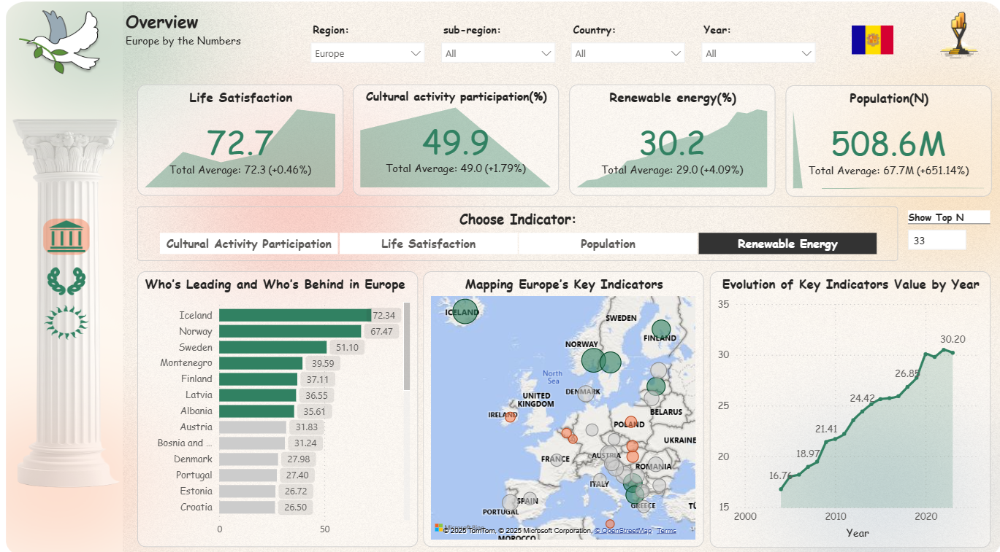
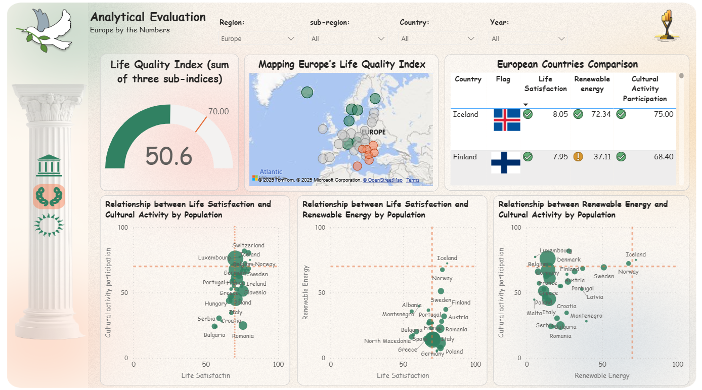
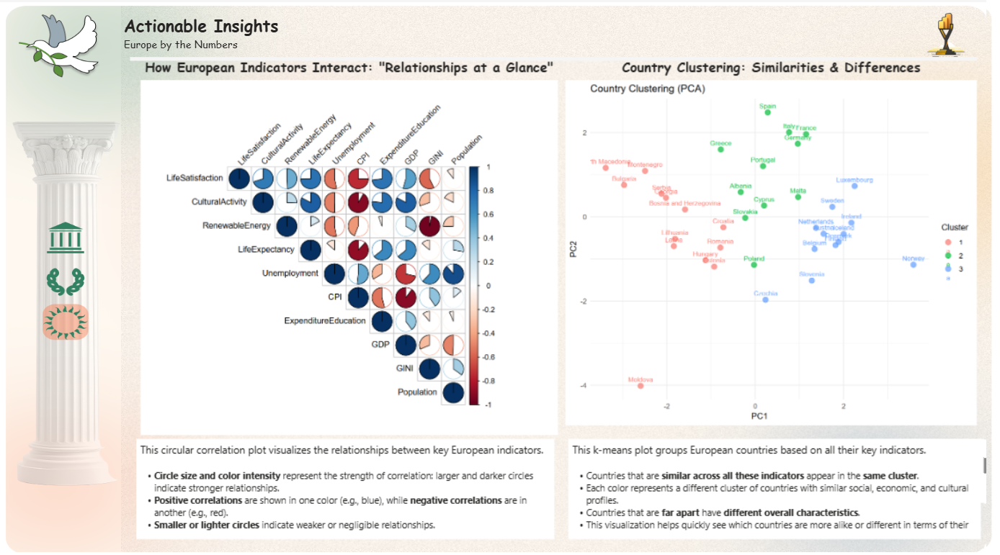

# Power-BI-DataViz-World-Champs-EU-Edition-

# Europe by the Numbers – World Champs Dashboard  

**Live Dashboard:** [View in Power BI Service](https://app.powerbi.com/view?r=eyJrIjoiY2Q4MDYzM2YtM2RkMi00MzRmLTg2NjAtOTc3YTc1OWJiNTEyIiwidCI6IjljNTRkZmMyLTMxMTktNDVlMC1hYTIzLWE5Nzg5ZDZiNzIyOCIsImMiOjEwfQ%3D%3D)

This repository contains my submission for the **Power BI Dataviz World Champs (EU edition)**.  
The dashboard explores **quality of life, culture, and sustainability across Europe** over time using open datasets. It is structured across three main pages: **Overview, Analytical Evaluation, and Actionable Insights**.

---

## Dashboard Objectives
- Provide an engaging, data-driven view of **European countries’ quality of life**.
- Enable comparison and ranking of countries across key indicators.
- Apply clustering and correlation techniques to uncover **patterns and influencing factors**.
- Deliver meaningful insights for **data journalists, analysts, and decision-makers**.

---

## Dashboard Pages

###  **Overview** /  **Analytical Evaluation** / **Actiobable Insights**
- High-level view of the key indicators: life satisfaction, renewable energy share, cultural participation, and population.
- Interactive **map-based rankings** to quickly identify leaders and laggards by indicator and year.
- Dynamic KPIs with highlights of top-5 and bottom-5 countries.

- **Clustering analysis** groups countries into peer sets (high, medium, low performance) for easier benchmarking.  
- Trend analysis across years to identify improvements or declines in sustainability and quality of life.  
- Comparative visuals that show regional and EU-wide variations.

- **Correlation and driver analysis** to explore the relationships between indicators (e.g., renewable energy vs. life satisfaction).  
- Scatterplots and regression visuals to highlight possible influencing factors on well-being.  
- Storytelling layer: helping identify **what matters most** for improving quality of life across Europe.  

---

## Key Indicators
- **Life Satisfaction** (Eurostat)  
- **Renewable Energy Share** (Eurostat)  
- **Cultural Activity Participation** (Eurostat)  
- **Population by Country & Year** (Our World in Data)  
- **Country Flags & Codes** (Flagpedia, ISO Mapping)  

---

## Tools & Technologies
- **Power BI** for dashboard design, interactivity, and advanced analytics.  
- **Power Query & DAX** for data transformation and modeling.  
- Data sources: **Eurostat, Our World in Data, Wikipedia Commons (flags)**.  

---

## How to Use
1. Open the **[Live Dashboard](https://app.powerbi.com/view?r=eyJrIjoiY2Q4MDYzM2YtM2RkMi00MzRmLTg2NjAtOTc3YTc1OWJiNTEyIiwidCI6IjljNTRkZmMyLTMxMTktNDVlMC1hYTIzLWE5Nzg5ZDZiNzIyOCIsImMiOjEwfQ%3D%3D)**.  
2. Navigate across the three pages: *Overview*, *Analytics*, and *Insights*.  
3. Use slicers to filter by year, country, or indicator.  
4. Explore the visuals for rankings, clusters, and correlations.  

---

##  Sample Screenshots

### Overview

### Analytics

### Insights

---

##  Notes
- This dashboard was created as part of the **Power BI Dataviz World Champs (EU edition)**.  
- The analysis is based on **public, open datasets**.  
- The report is designed for **data journalists and content creators**, helping them uncover patterns and communicate stories.  

👉 [Official Contest Repository](https://github.com/FabricCommunityContest/StarterFiles)

